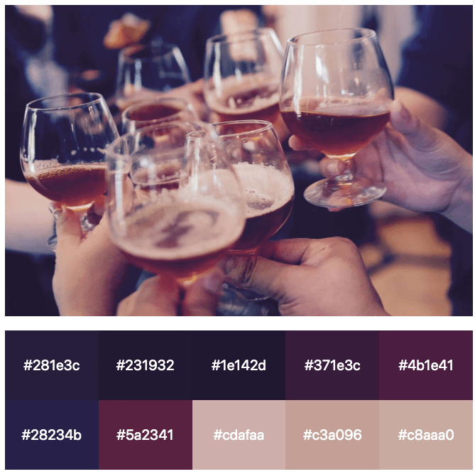

[](https://github.com/dimitrilongo/grav-plugin-image-color/releases)
[](https://github.com/dimitrilongo/grav-plugin-image-color/issues)
[](https://github.com/dimitrilongo/grav-plugin-image-color/archive/master.zip)
[](LICENSE.txt "License")

> This plugin introduces grabbing the color palette from an image and Calculating Color Contrast.

##### Table of Contents:

- [Grav Image Color Plugin](#grav-image-color-plugin)
- [Installation and Updates](#installation-and-updates)
- [Twig Functions](#twig-functions)
- [Usage](#usage)
  - [Examples :](#examples)
    - [Getting the first dominant color of a given image](#getting-the-first-dominant-color-of-a-given-image)
      - [Using `{{ GetImageColor() }}` without parameters:](#using--getimagecolor--without-parameters)
      - [Example Output for `{{ color }}`](#example-output-for--color)
      - [Using `{{ GetImageColor() }}` with parameters:](#using--getimagecolor--with-parameters)
      - [Parameters](#parameters)
        - [num_results (int)](#numresults-int)
        - [reduce_brightness (bool)](#reducebrightness-bool)
        - [reduce_gradients (bool)](#reducegradients-bool)
        - [delta (int) 1-255](#delta-int-1-255)
    - [Getting color palette of a given image](#getting-color-palette-of-a-given-image)
      - [Using `{{ GetContrastYIQ(hexcolor) }}` with parameters:](#using--getcontrastyiqhexcolor--with-parameters)
      - [Example Output for `{{ GetContrastYIQ }}`](#example-output-for--getcontrastyiq)
      - [Parameters](#parameters-1)
        - [hexcolor](#hexcolor)
- [Troubleshooting](#troubleshooting)
- [Disclaimer](#disclaimer)
- [Tested on Grav](#tested-on-grav)
- [Contributing](#contributing)
- [Licence](#licence)
- [Thanks](#thanks)

# Grav Image Color Plugin

The **Grav Image Color Plugin** for [Grav](http://github.com/getgrav/grav) adds the ability to get the dominant color from an image. You can generate a color palette from an image.

# Installation and Updates

The **Grav Image Color Plugin** is easy to install with GPM.

```
$ bin/gpm install image-color
```

Or clone from GitHub and put in the `user/plugins/image-color` folder.

For more informations, please check the [Installation and update guide](docs/INSTALL.md).

# Twig Functions

|Twig functions|Parameters|Docs|Return|
|-------------|-------------|-------------|-------------|
|`{{ GetImageColor() }}`| `num_results, reduce_brightness, reduce_gradients,delta`|Return palette|`array`|
|`{{ GetContrastYIQ() }}`|`hexcolor` |Calculating Color Contrast|`string`|

# Usage

Inside templates files.

## Examples :

### Getting the first dominant color of a given image

#### Using `{{ GetImageColor() }}` without parameters:

```twig

```

#### Example Output for `{{ color }}`
```
281e3c
```

#### Using `{{ GetImageColor() }}` with parameters:

```twig





```

#### Parameters

##### num_results (int)

Number of colors

Default value : `10`

##### reduce_brightness (bool)

Added a filter to reduce brightness variants of the same color.

Default value : `true`

##### reduce_gradients (bool)

Added a filter to reduce gradient variants ( useful for logos ).

Default value : `true`

##### delta (int) 1-255

Allow you to select the quantization delta. The smaller the delta the more accurate the color. This also increases the number of similar colors though.

Default value : `10`

### Getting color palette of a given image



```twig






  <div class="uk-tile uk-tile-default" style="background-color: #{{color}};">
      <p class="uk-h4">#{{color}}</p>
  </div>

```

#### Using `{{ GetContrastYIQ(hexcolor) }}` with parameters:

```twig


```
#### Example Output for `{{ GetContrastYIQ }}`
```
light
```

More info :

[Calculating Color Contrast](https://24ways.org/2010/calculating-color-contrast)

[YIQ](https://en.wikipedia.org/wiki/YIQ)

#### Parameters

##### hexcolor

six-character hex color

# Troubleshooting

If you find a bug, [please open a new issue][issues]

# Disclaimer

I've 'written' this plugin for my own use. It comes without any guarantee, so your mileage may vary in using it. If you find bugs or have great additions you'd like to share, use github to fork the project and share your improvements by initiating pull request

# Tested on Grav

[](https://packagist.org/packages/getgrav/grav)

# Contributing

You can contribute at any time! Before opening any issue, please search for existing issues and review the [guidelines for contributing](docs/CONTRIBUTING.md).

After that please note:

* If you find a bug, would like to make a feature request or suggest an improvement, [please open a new issue][issues]. If you have any interesting ideas for additions to the syntax please do suggest them as well!
* Feature requests are more likely to get attention if you include a clearly described use case.
* If you wish to submit a pull request, please make again sure that your request match the [guidelines for contributing](docs/CONTRIBUTING.md) and that you keep track of adding unit tests for any new or changed functionality.

See also the list of [contributors] who participated in this project.

# Licence

See [Licence](https://github.com/dimitrilongo/grav-plugin-image-color/blob/master/LICENSE.txt)

# Thanks

[Kepler Gelotte](http://www.coolphptools.com/color_extract)

[Csongor Zalatnai](http://www.phpclasses.org/browse/package/3370.html)

[Sommerregen/grav-plugin-shortcodes](https://github.com/Sommerregen/grav-plugin-shortcodes)

[getgrav/grav](https://github.com/getgrav/grav)

[github]: https://github.com/dimitrilongo/ "GitHub account from Dimitri Longo"
[mit-license]: http://www.opensource.org/licenses/mit-license.php "MIT license"

[project]: https://github.com/dimitrilongo/grav-plugin-image-color
[issues]: https://github.com/dimitrilongo/grav-plugin-image-color/issues "GitHub Issues for Grav Image Color Plugin"
[contributors]: https://github.com/dimitrilongo/grav-plugin-image-color/graphs/contributors "List of contributors of the project"
